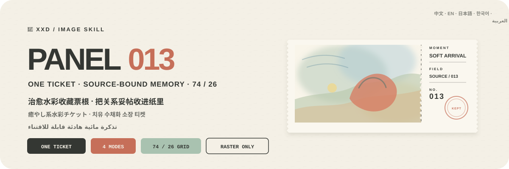
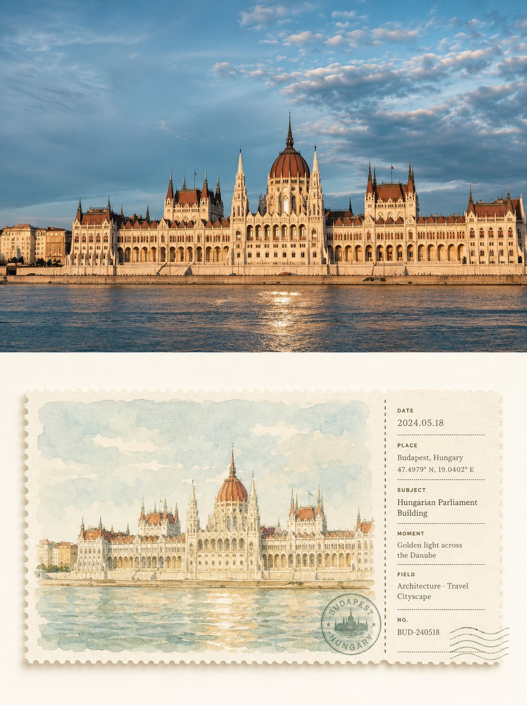
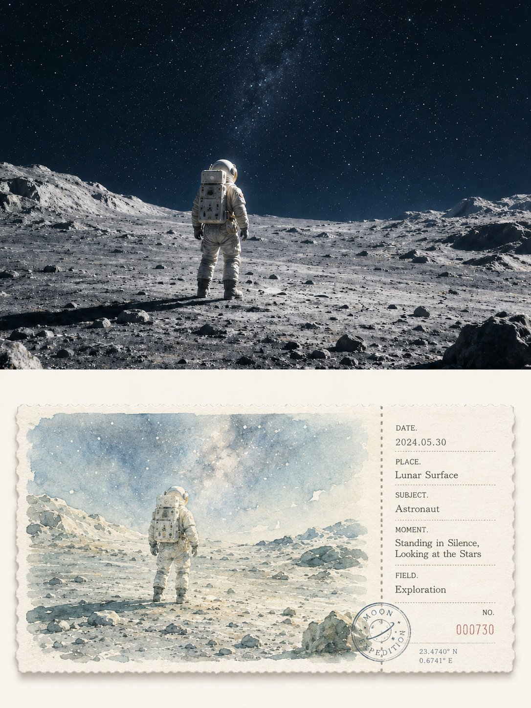
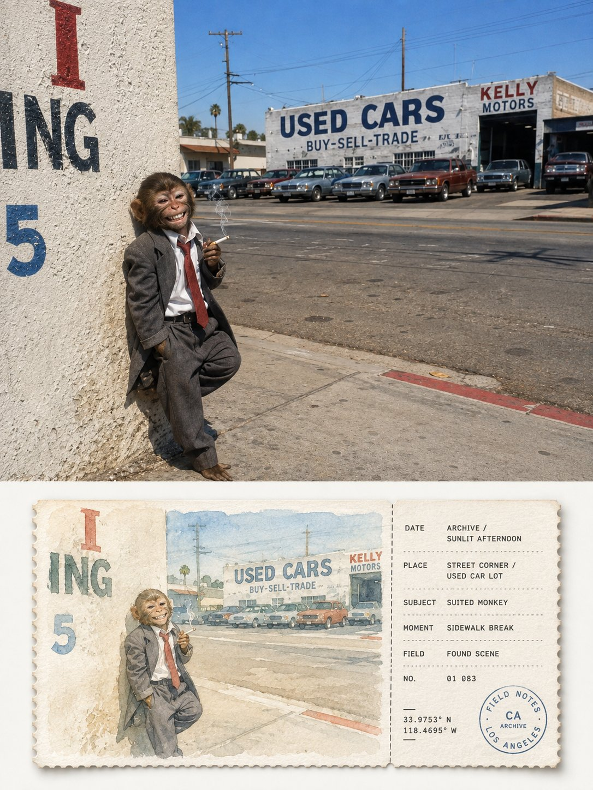
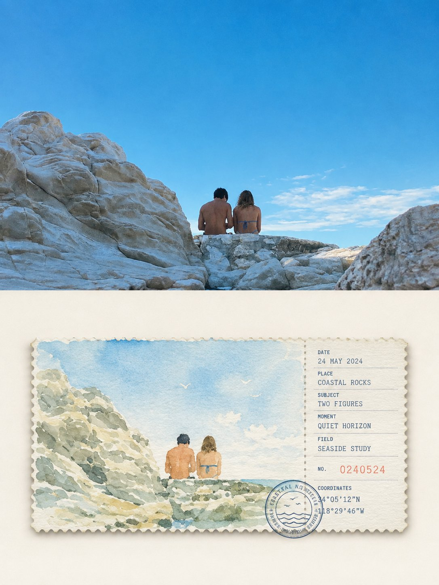

<p align="center">
  
</p>

<div align="center">

# 🦁 XXD Panel 013

### 写真を一枚の癒やし系水彩コレクションチケットへ

[](./SKILL.md)
[](#4つの出力を支えるひとつの水彩コレクションチケットロジック)
[](#境界と信頼性)

<a href="README.md">简体中文</a> · <a href="README.en.md">English</a> · <strong>日本語</strong> · <a href="README.ko.md">한국어</a> · <a href="README.ar.md">العربية</a>

</div>

> 横長チケット一枚 · 74/26 分割 · 癒やし系水彩 · 象牙色の余白 · 現地語の情報スタブ

XXD Panel 013 は、Codex と互換 Agent のための画像生成 Skill です。主体の個性、シルエット、姿勢と、記憶を成立させる必要な環境を保ち、その関係を孤立した物体画ではなく、中央に浮かぶ一枚の横長水彩チケットへまとめます。

内部は約 74/26 の左大・右小分割です。左は元写真を高明度・低〜中彩度の近似色 2〜4 色でやさしく水彩化し、右は対象言語の情報項目、番号、一つの控えめな円形印で整えます。厚いマット水彩紙、細かな毛羽立ち、極薄い接触影、広い象牙色の余白が、丁寧に保存された旅のスケッチ券の感触を作ります。

## なぜ 013 が必要なのか

一般的な「水彩ポストカード」は、全面の汎用風景、孤立した物体、汚れた古色フィルター、偽の座標と消印を貼った通販テンプレートへ崩れがちです。

013 は順序を逆にします。

```text
主体と必要な環境を固定 → 元写真固有の手掛かりを三つ以上残す → 一枚の中央配置横長チケットへ要約 → 内部を約 74/26 の絵とスタブへ分割 → 近い癒やし色 2〜4 色で水彩化 → 主体を少し明瞭にし環境を柔らかく弱める → 現地語項目、円印、ミシン目を一つのグリッドへ揃える
```

無関係な写真に替えても水彩の主体、必要な環境、色、項目の意味、印の関係、文言がほぼ成立するなら、それは 013 ではありません。

## 013 のビジュアル契約

- **主体と必要な環境：** 三つ以上の固有手掛かりで、個性、姿勢、尺度、位置、目印、空間関係を保ちます。
- **横長チケット一枚：** 広い象牙色の余白の中央に置き、反復、コラージュ、全面化をしません。
- **約 74/26：** 左の水彩面を明確に大きくし、右の情報スタブを一つの正確な縦ミシン目で分けます。
- **癒やし系水彩：** 元写真由来の高明度・低〜中彩度の近似色 2〜4 色、紙白、にじみ、乾湿差、少量の顔料粒子を残します。
- **抑制した階層：** 主体は少し明瞭、遠景と副次環境は自然に弱くし、写実的照明や複雑な細部を避けます。
- **収集物の紙感：** 厚いマット水彩紙、細かな毛羽または鋸歯、極薄い自然な接触影だけを使います。
- **情報グリッド：** 現地語の項目、番号、短線、点列、一つの円印を同じ左端、基線、間隔へ揃え、事実を捏造しません。

## 作例 · X より

> [小小東（@xiaoxiaodong01）](https://x.com/xiaoxiaodong01/status/2090111918921158977) · 2026-08-19<br>
> GPT2 x 票根 x 明信片 x 邮戳 x 美学提示词 x VOL.013

<table>
  <tr>
    <td width="50%"><a href="https://x.com/xiaoxiaodong01/status/2090111918921158977"></a></td>
    <td width="50%"><a href="https://x.com/xiaoxiaodong01/status/2090111918921158977"></a></td>
  </tr>
  <tr>
    <td width="50%"><a href="https://x.com/xiaoxiaodong01/status/2090111918921158977"></a></td>
    <td width="50%"><a href="https://x.com/xiaoxiaodong01/status/2090111918921158977"></a></td>
  </tr>
</table>

<p align="center"><a href="https://x.com/xiaoxiaodong01/status/2090111918921158977">元の投稿と完全なプロンプトを見る →</a></p>

これらの作例は 013 の美的意図を示すものであり、作例の被写体、構図、配色、コピー、旧キャンバス比率が生成時の参照や現在の既定値になることはありません。

## 原文プロンプトを唯一の美的基準にする

`references/013-source.md` が、このプロジェクト唯一の創作・美的基準です。Skill は原文を要約・拡張せず、共通の配色計画、美的動機、タイトル、マイクロコピーを追加しません。色、素材、構図、余白、言葉、タイポグラフィは、GPT Image 2 が原文プロンプトの規則どおりに実行します。

モードとサイズが上書きするのは、旧来の 3:4 上下構成だけです。左右モードでは「上の写真／下のデザイン」を左／右へ対応させ、デザイン単体と壁紙では下半分のデザイン言語をキャンバス全体へ広げます。それ以外の原文指示はすべて維持されます。

## 組み合わせ可能な4つの出力

`top-bottom`、`left-right`、`design-only`、`wallpaper-pack` は単独でも複数でも選べます。ペア構成は原則として一枚の完成キャンバスを直接生成し、決定論的な合成は再試行後の失敗、元写真のピクセル完全保持、または無損失サイズ調整のときだけ使います。

通常サイズも複数選択できます：自動適応、元画像比率、1:1、3:4、4:3、4:5、5:4、2:3、3:2、9:16、16:9、21:9、5:7、7:5、カスタム比率／正確なピクセル。暗黙の既定サイズはありません。異なる比率は、同じ原文プロンプトから個別に再構成します。

壁紙セットは連動型または独立型。連動型は最初の一枚を基準画像とし、残りを元写真＋基準画像から各端末向けに再構成します。一枚を四サイズへ機械的に切り抜くことはありません。

## 文字モード

生成前に次の一つを選びます。

1. **原文プロンプトに従ってモデルが文字を生成**：ユーザーは言語・地域だけを指定し、内容、量、調子、組版は GPT Image 2 が原文どおりに生成します。
2. **自分の正確な文言を使う**：一字一句そのまま渡し、書き換え・翻訳・タイトル追加をしません。組版は原文に従います。
3. **文字なし**：文字と疑似文字を厳格に禁止します。

外側の Skill はタイトルやマイクロコピーを先に書きません。出力言語は操作言語と別に確認し、人物、風景、ファイル名から推測しません。

## 完成キャンバス優先とラスター境界

画像モデルが完成画面全体の美的再構成を担当し、二連レイアウトも完成キャンバス一枚の直接生成を既定とします。`scripts/compose_panel.py` は条件付きの復旧、無劣化ピクセル調整、読み取り専用監査にだけ残し、毎回の事前計画や美的評価には使いません。

納品物はすべてPNGラスターで、呼び出しごとに `~/Desktop/xxd/` に新規タスクを作ります。設定済み画像経路は匿名化された状態だけを返し、提供元、接続先、認証情報、ヘッダー、プロンプト、応答、アカウント情報を公開しません。SVG、HTML、Canvas、図解、プログラム描画は最終作品の代替になりません。

## 宿主能力に適応する質問とインライン引数

同じ Skill が、宿主に実在する対話機能へ適応します。装飾記号をクリック可能な UI のようには見せません。

- **Claude Code に `AskUserQuestion + multiSelect: true` がある場合**：モードとサイズは本物のチェックボックス、文字方式と壁紙関係は単一選択。一般サイズは正方形・縦・横のグループに分け、選択を累積し、カスタム値は自由入力します。
- **Codex に `request_user_input` しかない場合**：文字方式や壁紙関係など、相互排他的な項目だけに使います。モードやサイズを単一選択に見せかけず、組み合わせ入力で受け取ります。
- **対話ツールがない場合**：1回目にモード、2回目にサイズ＋文字方式を入力します。偽の `- [ ]` は表示せず、フォームのためだけに Plan mode への切り替えも求めません。

2回目は最初に「自動推薦／元画像比率／一般比率／カスタム」だけを表示します。一般比率を選んだときだけ、正方形 `1:1`、縦 `3:4、4:5、2:3、9:16、5:7`、横 `4:3、5:4、3:2、16:9、21:9、7:5` を展開します。複数比率と正確なピクセルを指定できます。

すべての設定はインラインでも指定できます。

```text
/xxd-panel-013 photo.jpg --mode top-bottom,design-only --size auto,3:4,9:16 --text prompt --locale ja-JP
```

`--mode`、複数指定可能な `--size`、`--text prompt|exact|none`、`--locale`、`--copy`、`--wallpaper linked|independent`、`--wallpaper-size`、`--out` に対応します。必要な値が揃っていれば質問を省略し、不足分だけを尋ねます。

## 画像モデルの優先順位

GPT Image 2 を既定の第一候補とします。高忠実度の参照画像、生成前の完成キャンバス確認、二連モードの完成画面一括生成、条件を満たした場合だけのスクリプト合成という既存の流れは変わりません。

現在のツールまたは設定済み経路から実際に利用でき、元画像の忠実度、完成画角、対象言語の文字、連動壁紙の複数参照を満たせる場合は、Seedance 5.0 Pro、Nano Banana Pro（Gemini Image Pro）、Nano Banana 2（Gemini Image Flash）、その他の互換ビットマップモデルも利用できます。代替モデルが変更できるのは生成経路だけで、モード、画角、文案、言語、壁紙関係、完成キャンバス優先の方針は変更できません。

適切な経路がない場合は、画像生成ツールを有効にするか API Key を提供するようユーザーに案内します。ユーザーが提供した認証情報は現在のタスクで利用できますが、返信やログに再表示・記録・開示しません。明示的な依頼がない限り、長期保存やプロバイダー、アカウント、課金、グローバル経路の設定変更も行いません。

## 使い始める

```bash
git clone https://github.com/nevertoday/xxd-panel-013.git
mkdir -p ~/.codex/skills
ln -s "$(pwd)/xxd-panel-013" ~/.codex/skills/xxd-panel-013
```

Claude Code では同じフォルダを `~/.claude/skills/xxd-panel-013` にリンクできます。インストール後に Agent セッションを再起動してください。

```text
$xxd-panel-013
この写真を左右二連にしてください。文案は写真の意味から作り、自然な韓国語を使ってください。
```

写真だけでも呼び出せます。番号付きの複数行メニューでモードと文字設定を確認し、壁紙では連動／独立と端末サイズも確認します。

詳細仕様：

- [Skill ワークフロー](SKILL.md)
- [中国語ランタイムアダプター](references/xxd-panel-013-prompt.zh-CN.md)
- [英語ランタイムアダプター](references/xxd-panel-013-prompt.en.md)
- [元のスタイル指示](references/013-source.md)

## 境界と信頼性

- 各写真は独立したタスク内だけで使い、他の入力、旧成果物、作例の主題、色、文案、構図を借りません。
- 呼び出すたびに新しいタスクフォルダを作り、同じ原画像と条件でも新たに生成します。
- 成果物は PNG ビットマップであり、SVG、HTML、Canvas、プログラム描画の代替物ではありません。
- 設定済みビットマップブリッジは匿名化した状態だけを返し、プロバイダー、エンドポイント、ヘッダー、認証情報、プロンプト、応答本文を表示しません。
- 選択した通常モードごとに1点を返し、`wallpaper-pack` を選ぶと独立壁紙4点を追加します。`全部` は元写真1枚につき7点を4つの同階層モードフォルダへ出力し、一覧コラージュにはまとめません。

ローカル合成には Python 3 と Pillow が必要です。安全なビットマップブリッジは Python 3.11+ の `tomllib` を使用します。画像生成には、ホスト Agent の内蔵ラスター生成機能または設定済みの互換ルートが必要です。

## リポジトリ

```text
xxd-panel-013/
├── SKILL.md
├── README.md / README.en.md / README.ja.md / README.ko.md / README.ar.md
├── agents/openai.yaml
├── assets/banner.svg + examples/（今後のローカル作例用）
├── scripts/compose_panel.py + configured_imagegen.py
└── references/xxd-panel-013-prompt.zh-CN.md + xxd-panel-013-prompt.en.md + 013-source.md
```

## XXD について

XXD は小小東（Xiaoxiaodong）のブランド名の略称です。このプロジェクトは [@xiaoxiaodong01](https://x.com/xiaoxiaodong01) が制作・管理しています。

## サポートと会員制度

### 個別深度相談 · 1時間 CNY 299

Skills 利用に関する一対一相談は1時間 CNY 299です。下の WeChat QR コードから予約してください。

### Xiaoxiaodong Skills ユーザー交流グループ · CNY 99

一度 CNY 99 を支払うと、ワークフロー共有、作品相談、ユーザー同士の支援を行う交流グループに参加できます。時間制の個別相談は含まれません。

### 知識星球＋会員プロンプトライブラリ · 年額 CNY 699

[知識星球](https://wx.zsxq.com/group/15554814142882)と[XXD 会員プロンプトライブラリ](https://vip.xiaoxiaodong.ai/)は同じ会員権です。**一度の年額決済で両方を利用でき、二重の購入は不要です。**

1. 知識星球で加入後、WeChat でプロンプトライブラリの交換コードを受け取る。
2. プロンプトライブラリで加入後、WeChat で知識星球への招待を受け取る。

<p align="center">
  <a href="https://xiaoxiaodong.pages.dev/assets/wechat-qr.png"></a>
</p>

<div align="center">

**写真に旅テンプレートを被せず、その関係そのものを一枚の券として残す。**

</div>

---

<div align="center">
  <h2>☕ オープンソースプロジェクトを支援</h2>
  <p>このプロジェクトが時間の節約になったなら、Star、共有、コーヒー一杯で継続を支援できます。</p>
  <table><tr><td align="center" width="240">
    <a href="https://github.com/nevertoday/zhongguo-traditional-colors/blob/main/docs/images/buy-me-a-coffee-qr.png?raw=true"></a><br>
    <strong>Buy me a coffee</strong><br><sub>QR コードを読み取るか開いて支援できます</sub>
  </td></tr></table>
  <p><sub>支援は任意であり、このオープンソースプロジェクトの利用権には影響しません。</sub></p>
</div>
